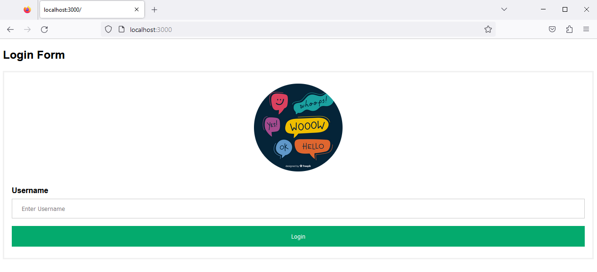
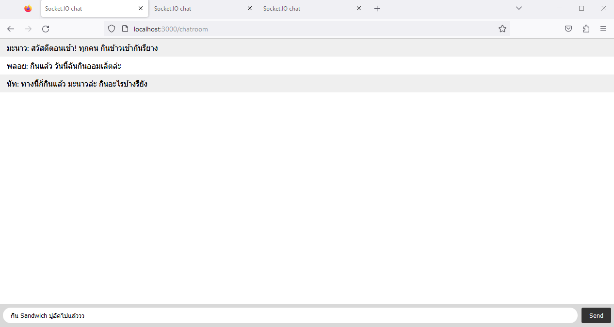

# เว็บ Real-time Chat ด้วย Node.js และ Socket.io

**Task Week 5 : Back-End Dev for Dev Init**

เมื่อผู้ใช้รันโปรแกรม เว็บ Real-time Chat นี้แล้ว ผู้ใช้จะสามารถเข้าใช้งานได้ที่เว็บ
```
http://localhost:3000/
```



จากภาพเมื่อเข้าไป ผู้ใช้จะพบกับหน้า Login Form โดยในหน้านี้จะให้ผู้ใช้ทำการกรอก `ชื่อ (Username)` ของตน ที่ต้องการให้ระบบทำการแสดงในหน้า Chat ลงในช่อง Username จากนั้นคลิกปุ่ม Login เพื่อทำการเข้าสู่ เว็บ Real-time Chat

จากนั้นระบบจะพาผู้ใช้เข้าไปยังหน้าเว็บ Real-time Chat โดยในหน้านี้ผู้ใช้สามารถพิมพ์ข้อความที่ตนต้องการลงไปในช่องแชทข้างล่าง และกดปุ่ม Send ที่อยู่มุมขวาล่าง เพื่อส่งข้อความได้เลย ซึ่งข้อความนี้จะถูกส่งไปยังทุกคนที่กำลังเข้าใช้งาน เว็บ Real-time Chat อยู่ในขณะนั้น โดยไม่ต้องรีเฟรชหน้าเว็บ ทำให้ทุกคนสามารถพิมพ์ข้อความโต้ตอบกันแบบ Real-time ได้ ดังภาพ



และนี่คือการจำลองสถานการณ์ Real-time Chat ของบุคคล 3 คน คือ มะนาว พลอย และนัท โดยเมื่อผู้ใช้ทำการส่งข้อความไปในระบบ ระบบก็จะทำการระบุ ชื่อ (Username) ของผู้ส่งให้โดยอัตโนมัติ